 

<em>Digital products built with precision, not accidents.</em>

## ⟡ About

I don't just ship features — I design systems, weigh trade-offs, and refine until the seams disappear. Quality and long-term maintainability come before speed; speed comes right after.

 

## ⟡ Identity

<h3><code>frank@github ~ $ whoami</code></h3>

<table>
<tr>
<td valign="top"></td>
<td valign="top"></td>
</tr>
</table>

 

## ⟡ Stack

<table>
<tr>
<td valign="top" width="25%">

**Frontend**

</td>
<td valign="top" width="25%">

**Backend & Data**

</td>
<td valign="top" width="25%">

**DevOps & Tooling**

</td>
<td valign="top" width="25%">

**AI Tooling**

</td>
</tr>
</table>

 

## ⟡ Activity

<h3><code>frank@github ~ $ ./contributions.sh</code></h3>

  

 

Open to ambitious products, remote roles, and problems worth solving properly.

